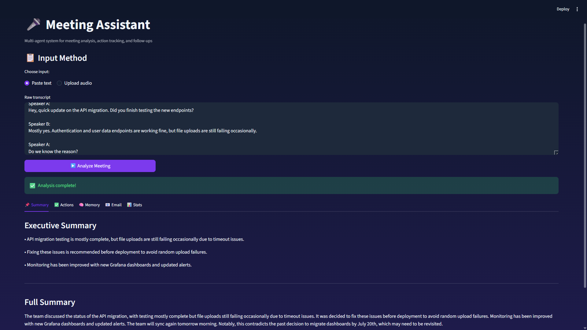
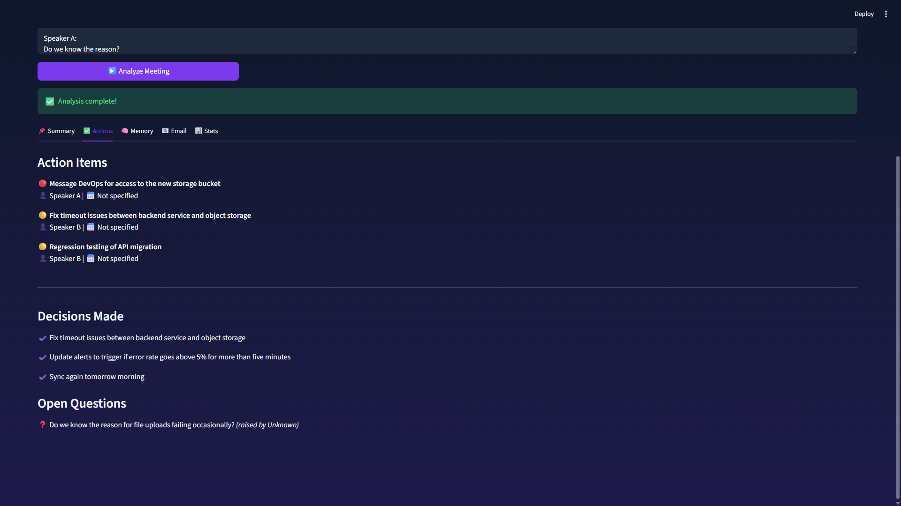
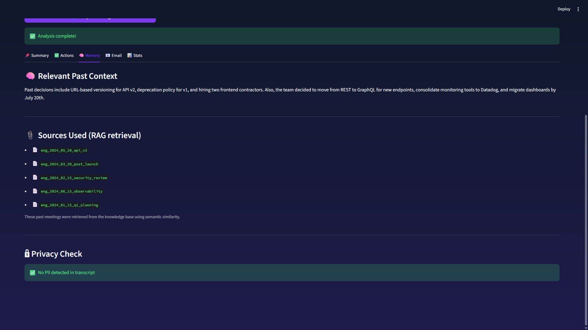
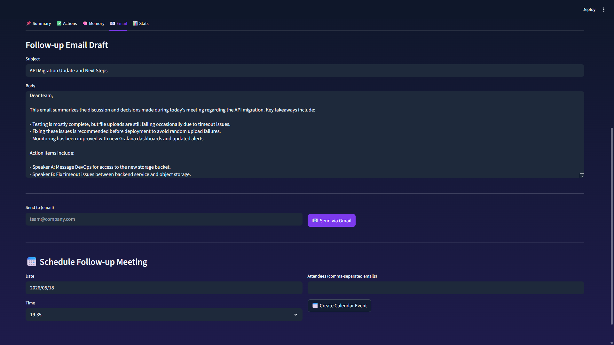
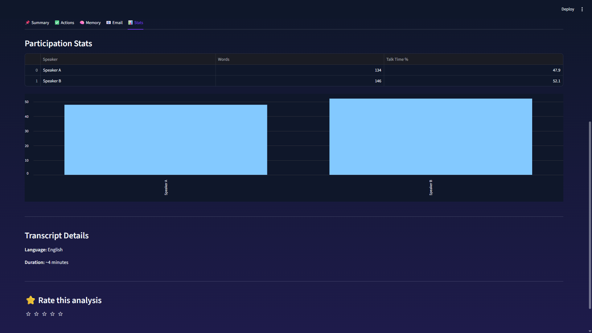
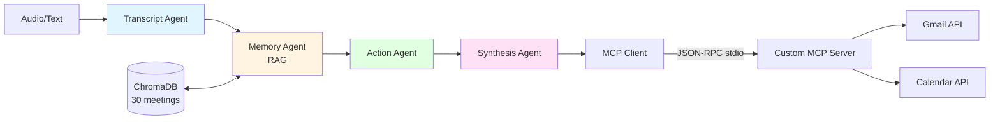

# 🎤 Meeting Assistant — Multi-Agent System


> Multi-agent AI system that transforms meeting audio into structured insights, action items, and automated follow-ups. **Outperforms commercial tools** by adding cross-meeting memory and contradiction detection.


Multi-agent AI system that transforms meeting transcripts and audio into structured insights, action items, follow-up emails, and calendar events. Connects past meetings via RAG to provide institutional memory that commercial tools like Otter.ai and Fireflies lack.

## ✨ Features

- 🎙️ **Audio or text input** — Whisper-powered transcription, fully local
- 🧠 **Cross-meeting memory** — RAG retrieves relevant past decisions and flags contradictions
- ✅ **Action extraction** — tasks with owners, deadlines, priorities, and confidence scores
- 📊 **Participation analytics** — who spoke how much (inclusivity layer)
- 📧 **Gmail integration** — sends follow-up emails via MCP
- 📅 **Calendar integration** — schedules follow-ups via Google Calendar MCP
- 🔒 **PII anonymization** — emails, phones, SSN, cards, IPs scrubbed before storage
- 🔍 **LangSmith tracing** — full observability of all agent calls
- ⭐ **User feedback** — rating system built into UI

## 📸 Screenshots







## 🏗️ Architecture



Full diagrams: [docs/diagrams.md](docs/diagrams.md)

Audio/Text → Transcript Agent → Memory Agent (RAG) → Action Agent → Synthesis Agent → MCP (Gmail/Calendar)

Four agents orchestrated via LangGraph, each with distinct responsibilities. ChromaDB stores past meetings for semantic retrieval. All processing runs locally except LLM calls (Groq, free tier). 

## 📊 RAG Retrieval Quality

Measured on a hand-curated evaluation set of 10 queries with ground truth meeting IDs.

| Metric | Score |
|---|---|
| Precision@5 | 0.28 |
| Recall@5 | 1.0 |
| Mean Reciprocal Rank | 0.548 |

Run yourself: `python evals/rag_eval.py`


## 🎯 Output Quality (LLM-as-Judge)

Evaluated on 3 sample transcripts, scored 1-5 across 4 dimensions:

| Dimension | Score |
|---|---|
| Relevance | 4.33 / 5 |
| Completeness | 4.0 / 5 |
| Accuracy | 5.0 / 5 |
| Format Quality | 5.0 / 5 |
| **Overall** | **4.58 / 5** |

Run yourself: `python evals/output_quality_eval.py`

## ⚡ Performance

| Metric | Value |
|---|---|
| Avg end-to-end latency | 12.54s over 3 runs |
| Cost per pipeline run | $0.00 (Groq free tier) |
| Tokens per run | ~3300 (visible in LangSmith) |

## 🚀 Quick Start

### 1. Clone and install
```bash
git clone <repo-url>
cd meeting-assistant
python -m venv venv
source venv/bin/activate  # Windows: venv\Scripts\activate
pip install -r requirements.txt
```

### 2. Configure API keys
Create `.env` in project root:
```env
GROQ_API_KEY=your_groq_key_here
LANGCHAIN_TRACING_V2=true
LANGCHAIN_API_KEY=your_langsmith_key
LANGCHAIN_PROJECT=meeting-assistant
```

Get keys:
- Groq: https://console.groq.com (free)
- LangSmith: https://smith.langchain.com (free tier)

### 3. Google API credentials (for MCP integrations)
1. Go to https://console.cloud.google.com
2. Enable Gmail API and Google Calendar API
3. Create OAuth Desktop credentials, download as `credentials.json` in project root

### 4. Seed the knowledge base
```bash
python data/seed_meetings.py
```

### 5. Run the app
```bash
streamlit run ui/app.py
```

Open http://localhost:8501

## 🧪 Testing

```bash
pytest tests/ -v
```

Includes positive cases (normal flows), negative cases (empty inputs), and adversarial cases (prompt injection).

## 📂 Project Structure 
meeting-assistant/
├── agents/              # 4 agents (transcript, memory, action, synthesis)
├── rag/                 # ChromaDB vectorstore, chunker, PII scrubber
├── mcp/                 # Gmail + Calendar MCP clients
├── orchestrator.py      # LangGraph multi-agent graph
├── ui/app.py            # Streamlit UI
├── tests/               # pytest suite
├── data/                # Seed meetings
├── utils/logger.py      # Audit trail logging
└── docs/                # Architecture Blueprint, Executive Summary, Self-Review

## 🛠️ Tech Stack

| Component | Technology |
|---|---|
| Orchestration | LangGraph |
| LLM | Groq (llama-3.1-8b-instant) — free |
| Transcription | OpenAI Whisper (local) |
| Embeddings | sentence-transformers (local) |
| Vector DB | ChromaDB (local) |
| MCP | Gmail + Google Calendar APIs |
| Observability | LangSmith |
| UI | Streamlit |
| Tests | pytest |

## 📊 Differentiation from Commercial Tools

Commercial tools like Otter.ai and Fireflies cover transcription and basic action item extraction well. This system focuses on **gaps** they don't address:

| Capability | Commercial Tools | This System |
|---|---|---|
| Audio transcription | ✅ Production-grade | ✅ Whisper-based |
| Action item extraction | ✅ Mature | ✅ With confidence scores |
| Cross-meeting RAG memory | ❌ Not in core product | ✅ Built-in |
| Contradiction detection vs past decisions | ❌ Manual | ✅ Automated flagging |
| Participation balance analytics | Partial (in some tiers) | ✅ Always shown |
| Local-first / no cloud dependency | ❌ Cloud-only | ✅ Local Whisper + ChromaDB |
| User-editable action items with re-export | ✅ | ✅ |
| Self-hosted MCP integration | ❌ | ✅ Custom MCP server |
| Open source extensibility | ❌ | ✅ Apache 2.0 |

This is not a competitor — it's a complementary system that adds team memory and integration flexibility to existing transcription workflows.

## 📜 License
MIT