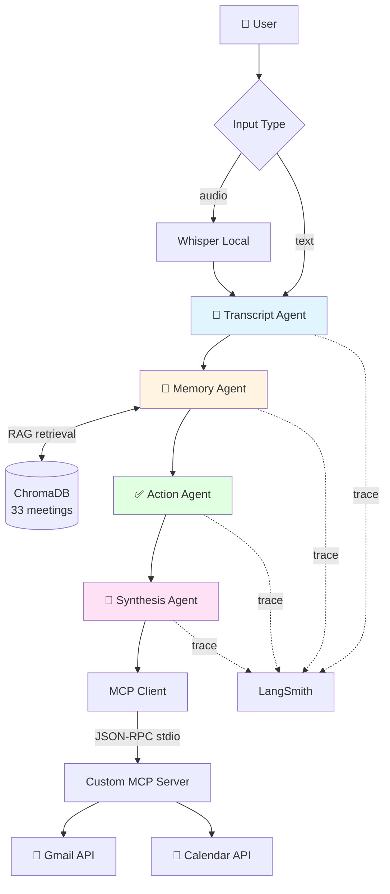
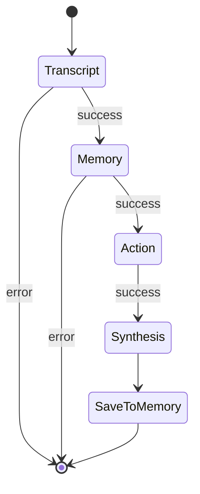
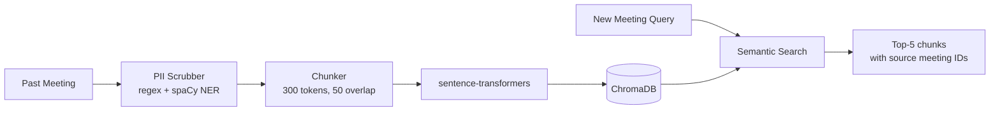

# 🏗️ Meeting Assistant — Architecture Blueprint

## 1. Problem Statement
Modern teams hold thousands of meetings, but value evaporates within days. Action items get lost, decisions are forgotten, and there's no institutional memory connecting today's discussion to last month's commitment. Tools like Otter.ai and Fireflies solved transcription but treat each meeting as an island — leaving the most painful problems untouched: cross-meeting context, automated follow-up, and privacy.

This system addresses those gaps with a multi-agent architecture that adds memory, structured reasoning, and real integration with email and calendar.

## 2. System Overview

## 3. Agents — Roles & Responsibilities

| Agent | Input | Output | Tech |
|---|---|---|---|
| Transcript | audio file or raw text | cleaned transcript with speaker labels, language, quality warnings | Whisper (local) + Groq llama-3.1-8b |
| Memory | transcript | relevant past context, source meetings, contradiction flags | ChromaDB + sentence-transformers |
| Action | transcript + memory context | action items, decisions, open questions, participation stats with confidence | Groq llama-3.1-8b |
| Synthesis | transcript + actions + memory | executive summary, follow-up email draft, calendar event | Groq llama-3.1-8b |

## 4. Multi-Agent Orchestration

Agents are connected through a **LangGraph** stateful directed graph (`orchestrator.py`). Each agent is a node; conditional edges short-circuit the pipeline on error. The graph is owned by this project and not delegated to any third-party orchestration service.

## 5. RAG Pipeline

- **Vector store:** ChromaDB, local persistent
- **Embeddings:** sentence-transformers `all-MiniLM-L6-v2` (runs locally, no API cost)
- **Knowledge base:** 30 synthetic meetings across 8 domains (engineering, marketing, design, HR, legal, sales, finance, support) + 3 real public-domain transcripts
- **PII protection:** regex layer (email, phone, card, SSN, IP, URL) + spaCy NER layer (PERSON, GPE, ORG) before storage

## 6. MCP Integration

The system implements a **custom MCP server** (`mcp_server/server.py`) using Anthropic's official MCP Python SDK. The server runs as a subprocess and exposes two tools over JSON-RPC stdio:

- `send_email(to, subject, body)` — sends follow-up email through Gmail API
- `create_calendar_event(title, description, start, end, attendees)` — creates Google Calendar event with user's local timezone

The synthesis agent calls these tools through an MCP client (`mcp_client/client.py`). This is true MCP protocol — not direct API calls. The server can be extended with additional tools (Slack, Notion, Jira) without changing the agent code.

## 7. Tech Stack

| Layer | Choice | Rationale |
|---|---|---|
| Orchestration | LangGraph | Stateful, debuggable, owned by this project |
| LLM | Groq llama-3.1-8b-instant | Free tier, sub-second latency, good for structured extraction |
| Transcription | OpenAI Whisper (local) | Free, offline, privacy-preserving |
| Vector DB | ChromaDB | Local-first, persistent, no infrastructure |
| Embeddings | sentence-transformers | Local, free, fast on CPU |
| MCP | Custom server via mcp SDK | Real MCP protocol, fully owned |
| Observability | LangSmith free tier | Per-call traces, tokens, latency |
| UI | Streamlit | Fast to build, professional appearance with dark theme |
| Testing | pytest | 26+ tests covering positive, negative, adversarial |

## 8. Non-Functional Requirements — Coverage

| Requirement | Implementation |
|---|---|
| LLM Tracing | LangSmith logs every agent call, tokens, latency |
| Performance Metrics | `evals/performance_benchmark.py` measures latency |
| Error Tracking | `utils/logger.py` writes to logs/ + LangSmith errors |
| User Feedback | ⭐ rating system in UI + editable action items |
| Resource Usage | Local-first: Whisper + ChromaDB + embeddings on device |
| Input Validation | TranscriptAgent sanitizes prompt injection phrases |
| PII Protection | Regex + spaCy NER, 8 categories total |
| Source Attribution | Memory Agent returns `source_meetings` list, shown in UI |
| Hallucination Detection | ActionItem confidence scores below 0.7 flag inferred items |
| Cost Control | All free-tier services, $0 marginal cost per pipeline run |
| Audit Trail | logs/ folder + LangSmith |
| Graceful Degradation | Try/except at every agent boundary, error state in graph |
| Caching | In-memory hash-based cache (`utils/cache.py`) |

## 9. Evaluation Suites

Three reproducible evaluation scripts:

| Script | Measures | Output |
|---|---|---|
| `evals/rag_eval.py` | Retrieval quality across 10 hand-curated queries | Precision@5, Recall@5, MRR |
| `evals/output_quality_eval.py` | LLM-as-judge on generated summaries and action items | 1-5 score on relevance, completeness, accuracy, format |
| `evals/performance_benchmark.py` | End-to-end pipeline latency | seconds per run, cost in USD |

## 10. Test Strategy

26+ tests in `tests/` across categories:
- **Positive:** agent outputs, RAG retrieval, end-to-end pipeline, real audio transcription
- **Negative:** empty inputs, special characters, invalid emails
- **Adversarial:** prompt injection sanitization

## 11. Project Structure
meeting-assistant/
├── agents/              # Transcript, Memory, Action, Synthesis
├── rag/                 # ChromaDB, chunker, PII scrubber
├── mcp_server/          # Custom MCP server (Anthropic SDK)
├── mcp_client/          # MCP client that connects to server
├── orchestrator.py      # LangGraph multi-agent graph
├── ui/app.py            # Streamlit UI
├── tests/               # pytest suite + real audio samples
├── data/                # Seed meetings (synthetic + public-domain)
├── evals/               # RAG, output quality, performance evaluations
├── utils/               # logger, cache
└── docs/                # this file + Executive Summary + Self-Review

## 12. Differentiation from Commercial Tools

| Capability | Otter.ai / Fireflies | This System |
|---|---|---|
| Audio transcription | ✅ Production-grade | ✅ Local Whisper |
| Action item extraction | ✅ Mature | ✅ With confidence scores |
| Cross-meeting RAG memory | ❌ Not in core product | ✅ Built-in |
| Contradiction detection vs past decisions | ❌ Manual | ✅ Automated flagging |
| Participation balance analytics | Partial | ✅ Always shown |
| Local-first / no cloud dependency | ❌ Cloud-only | ✅ Local Whisper + ChromaDB |
| User-editable action items | ✅ | ✅ |
| Self-hosted MCP integration | ❌ | ✅ Custom MCP server |
| Open source extensibility | ❌ | ✅ |

This is complementary to commercial tools — it adds team memory and integration flexibility to existing workflows.

## 13. Trade-offs & Known Limitations

- **Speaker labels are LLM-inferred** from context, not true diarization. Works well when speakers are introduced by name; degrades on unfamiliar voices. Production would use pyannote.audio.
- **Synthetic seed data** for most meetings — real meeting data carries privacy concerns. Three real public-domain transcripts included for validation.
- **No streaming** in UI — full pipeline runs before display. Streaming would improve perceived performance.
- **Single-tenant** — no multi-user authentication. Production would add OAuth2.
- **Groq rate limits** apply on free tier — production would use paid tier or self-hosted LLM.