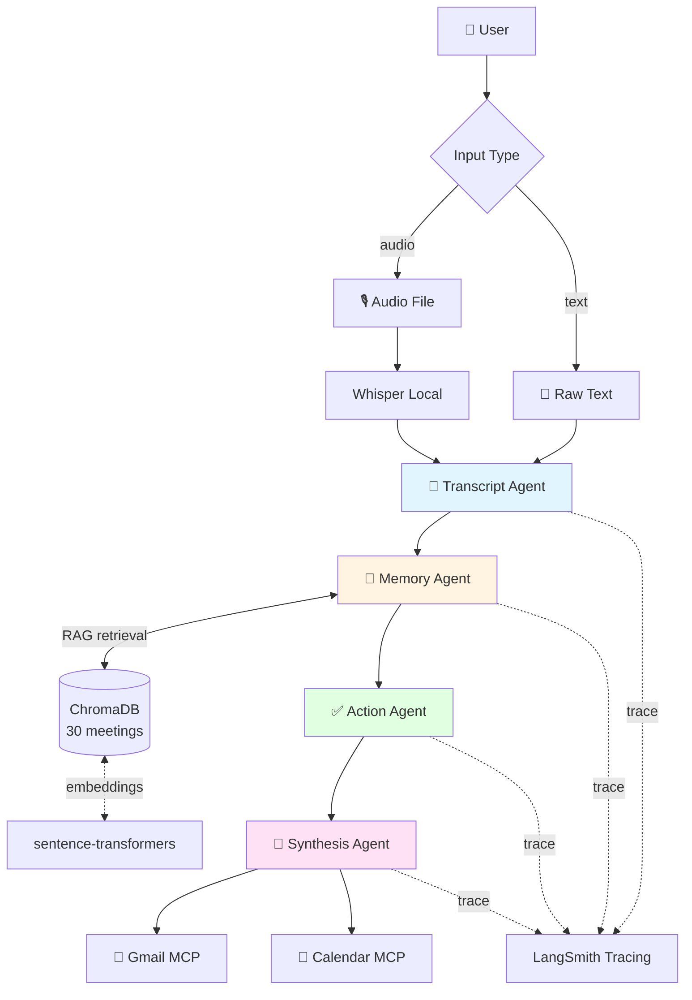
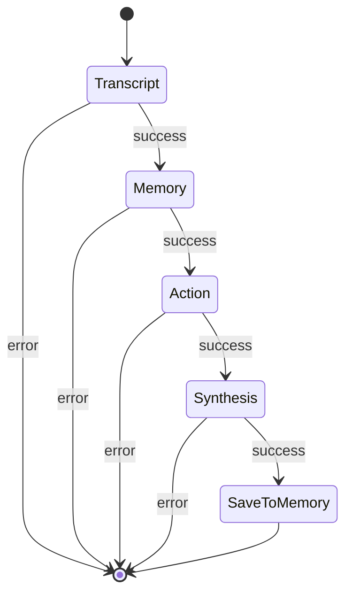
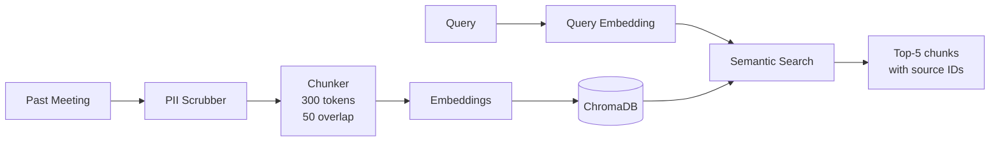

# Architecture Diagrams

## System Overview

```mermaid
flowchart TD
    User[👤 User]
    Input{Input Type}
    Audio[🎙️ Audio File]
    Text[📝 Raw Text]
    
    Whisper[Whisper Local]
    
    TA[🎤 Transcript Agent]
    MA[🧠 Memory Agent]
    AA[✅ Action Agent]
    SA[📝 Synthesis Agent]
    
    Chroma[(ChromaDB<br/>30 meetings)]
    Embed[sentence-transformers]
    
    Gmail[📧 Gmail MCP]
    Cal[📅 Calendar MCP]
    
    LS[LangSmith Tracing]
    
    User --> Input
    Input -->|audio| Audio
    Input -->|text| Text
    Audio --> Whisper --> TA
    Text --> TA
    TA --> MA
    MA <-->|RAG retrieval| Chroma
    Chroma <-.->|embeddings| Embed
    MA --> AA
    AA --> SA
    SA --> Gmail
    SA --> Cal
    
    TA -.->|trace| LS
    MA -.->|trace| LS
    AA -.->|trace| LS
    SA -.->|trace| LS
    
    style TA fill:#e1f5ff
    style MA fill:#fff4e1
    style AA fill:#e1ffe1
    style SA fill:#ffe1f5
```

## Multi-Agent State Flow (LangGraph)

```mermaid
stateDiagram-v2
    [*] --> Transcript
    Transcript --> Memory: success
    Transcript --> [*]: error
    Memory --> Action: success
    Memory --> [*]: error
    Action --> Synthesis: success
    Action --> [*]: error
    Synthesis --> SaveToMemory: success
    Synthesis --> [*]: error
    SaveToMemory --> [*]
```

## RAG Pipeline

```mermaid
flowchart LR
    Doc[Past Meeting] --> PII[PII Scrubber]
    PII --> Chunk[Chunker<br/>300 tokens<br/>50 overlap]
    Chunk --> Em[Embeddings]
    Em --> DB[(ChromaDB)]
    
    Q[Query] --> QEm[Query Embedding]
    QEm --> Search[Semantic Search]
    DB --> Search
    Search --> Top5[Top-5 chunks<br/>with source IDs]
```